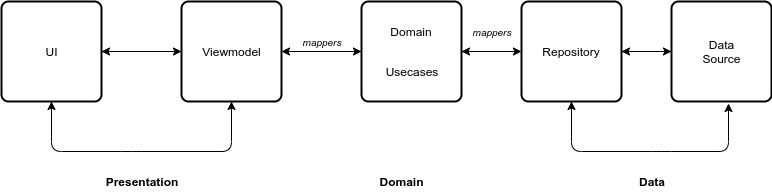

## Movie App
- Android application using [TMDM API] to display list of movies. It is build using MVVM Architecture, Kotlin Programming language and Jetpack Components.
- Minimum API Level: 21 [Supports Over 84% Devices].
- Build system: [Gradle]().
 

- [Prerequisite](prerequisite)
- [TechStack](##techstack)
- [Architecture](##architecture)
- [Screenshots](##screenshots)
- [HelpfulResources](##helpresources)

## Prerequisite
-To run the application to need to [Clone](clone).
-Install Android Studio. 

## TechStack
- [Jetpack]() -
- [Kotlin]() - Statically typed, general purpose programming language.
- [Dagger-Hilt]() - Dependency injection framework.
- [View Binding]() - Support library that allows binding of UI components in layouts.
- [Coroutines]() - Perform background operations.
- [Retrofit]() - Type-safe REST client for Android and Java.
- [Room]() - Persistence library that provides an abstraction layer over SQLite.
- [LiveData]() - Observable data holder.
- [Lifecyle]() - 
- [ViewModel]() - store and manage UI-related data in a lifecycle concious way.
- [Timber]() - Extensible android logger.

## Architecture
- MVVM
 
## ScreenShots
 
## HelpfulResources
